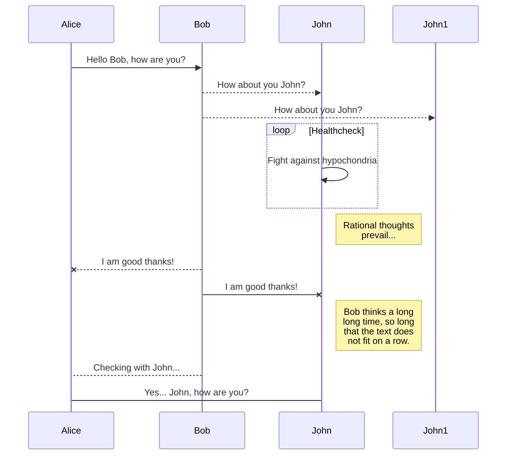
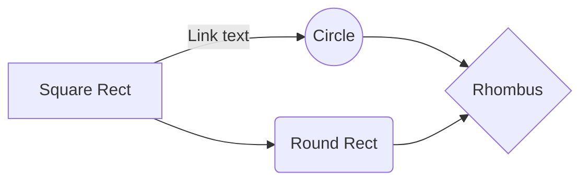
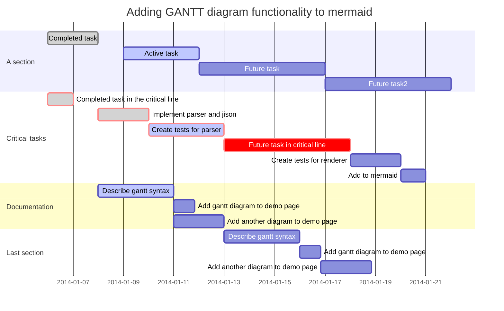

# Documentation demo

Hi! I'm your first Markdown file in **StackEdit**. If you want to learn about StackEdit, you can read me. If you want to play with Markdown, you can edit me. If you have finished with me, you can just create new files by opening the **file explorer** on the left corner of the navigation bar.

# Test one

ttt

# Text

## Formatting
This text is _emphasized with underscores_, and this is *emphasized with asterisks*.

This text is __emphasized with underscores__, and this is **emphasized with asterisks**.

This ~~is deleted text.~~

What is the difference between `>>=` and `>>`?

Here is a literal backtick `` ` ``.

## Links
[one with a title](http://fsf.org "click here for a good time!")

Link to [Documentation demo].

## Blocks
### Block quotations

> This is a block quote. This
> paragraph has two lines.
>
> 1. This is a list inside a block quote.
> 2. Second item.

### Verbatim (code) blocks
    if (a > 3) {
        moveShip(5 * gravity, DOWN);
    }

### Fenced code blocks
~~~~~~~
if (a > 3) {
  moveShip(5 * gravity, DOWN);
}
~~~~~~~

## List
* one
* two
* three

* fruits
    * apples
        * macintosh
        * red delicious
    - pears
    - peaches
* vegetables
    * broccoli
    + chard

1.  one
1.  two
1.  three

Term 1
:   Definition 1

Term 2 with *inline markup*
:   Definition 2

        { some code, part of Definition 2 }

    Third paragraph of definition 2.

# Tables
## simple_tables
-------     ------ ----------   -------
     12     12        12             12
    123     123       123           123
      1     1          1              1
-------     ------ ----------   -------

## pipe_tables

| Right | Left | Default | Center |
|------:|:-----|---------|:------:|
|   12  |  12  |    12   |    12  |
|  123  |  123 |   123   |   123  |
|    1  |    1 |     1   |     1  |

|                  | ASCII                           | HTML                          |
|------------------|---------------------------------|-------------------------------|
| Single backticks | `'Isn't this fun?'`             | 'Isn't this fun?'    test     |
| Quotes           | `"Isn't this fun?"`             | "Isn't this fun?"             |
| Dashes           | `-- is en-dash, --- is em-dash` | -- is en-dash, --- is em-dash |

## multiline_tables

+---------------+---------------+--------------------+
| Fruit         | Price         | Advantages         |
+===============+===============+====================+
| Bananas       | $1.34         | - built-in wrapper |
|               |               | - bright color     |
+---------------+---------------+--------------------+
| Oranges       | $2.10         | - cures scurvy     |
|               |               | - tasty            |
+---------------+---------------+--------------------+

## html table

<table>
<tr>
    <td colspan="3">1</td>
    <td>4</td>
    <td rowspan="3">5</td>
</tr>
<tr>
    <td>1</td>
    <td rowspan="2">2</td>
    <td>3</td>
    <td>4</td>
</tr>
<tr>
    <td rowspan="2">1</td>
    <td>3</td>
    <td>4</td>
</tr>
<tr>
    <td colspan="3">2</td>
    <td>5</td>
</tr>
<tr>
    <td>1</td>
    <td>2</td>
    <td colspan="3">3</td>
</tr>
</table>

# Images

{#id .class width=30 height=20px}

{ width=50% }

# Markdown extensions

StackEdit extends the standard Markdown syntax by adding extra **Markdown extensions**, providing you with some nice features.

> **ProTip:** You can disable any **Markdown extension** in the **File properties** dialog.

## KaTeX

You can render LaTeX mathematical expressions using [KaTeX](https://khan.github.io/KaTeX/):

The *Gamma function* satisfying $\Gamma(n) = (n-1)!\quad\forall n\in\mathbb N$ is via the Euler integral

$$
\Gamma(z) = \int_0^\infty t^{z-1}e^{-t}dt\,.
$$

> You can find more information about **LaTeX** mathematical expressions [here](http://meta.math.stackexchange.com/questions/5020/mathjax-basic-tutorial-and-quick-reference).

## UML diagrams

You can render UML diagrams using [Mermaid](https://mermaidjs.github.io/). For example, this will produce a sequence diagram:

And this will produce a flow chart:

